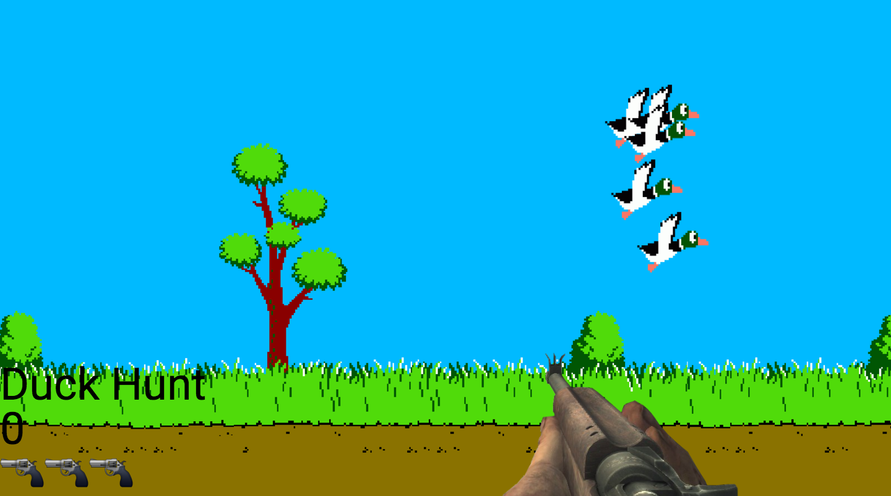

# DuckHunt

## What is DuckHunt?

DuckHunt is a simple point and click game that is playable in the browser. The objective of the game is to 
kill all the ducks on the screen and reach the target score for the difficulty level. 

## Technical Discussion

- HTML5
- CSS3
- JavaScript with jQuery library

### Notes on Game Structure

> Code samples, description of challenges you overcame, etc.

## The Making of DuckHunt

Just the average blood, sweat, and tears. 😌

## Opportunities for Future Growth
I'm aware of a bug that allows the player to keep playing even if they won or lost. On top of that because I was constantly calling a function to make the ducks move, sometimes it will glitch out when you click on a duck as the function is being called. So then the duck appears on the screen longer allowing the user to shoot it multiple times. In the future it would be better to make sure that the game actually ends when a player wins or loses. In my case even though the "game is over" the player is still capable of clicking on elements. It would be better if the ducks bounced off of the walls instead of just flying back and forth, and up and down. This would allow for more better fluid random movement. 
